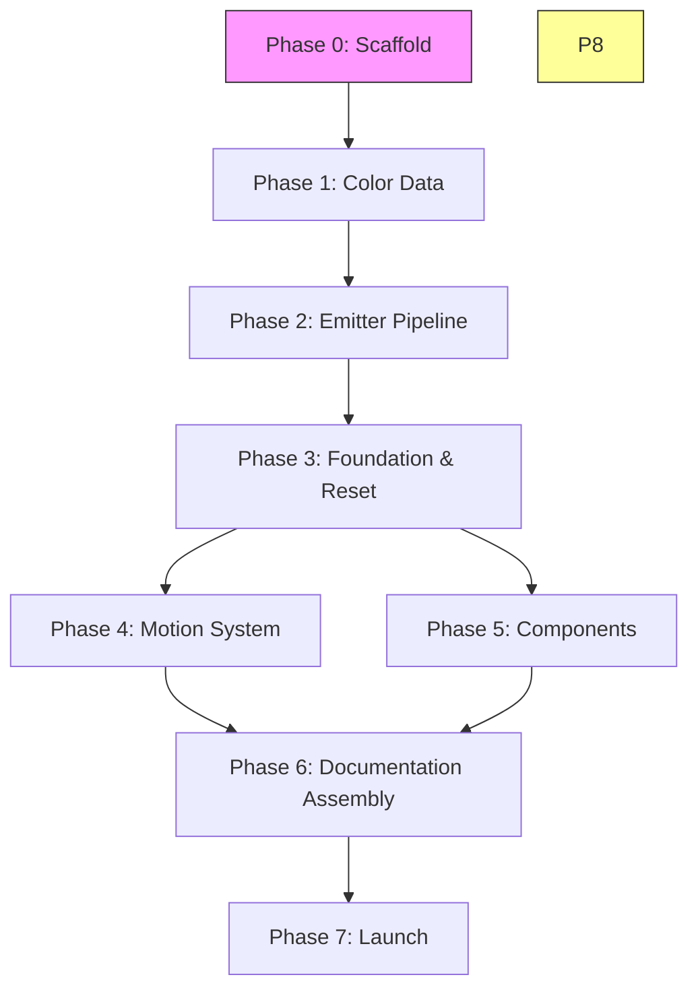
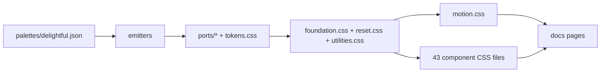

# Execution Guide — Delightful Design System MVP

How to orchestrate the MVP build using Claude Code and AI agents. This guide is written for a technical operator who understands what needs to be built but has not run this type of agent-driven workflow before.

---

## What You're Building

The Delightful Design System is a CSS-first design system with a neo-brutalist aesthetic: OKLCH color, 2px borders, zero-blur solid shadows, lift/press interactions. A single palette JSON file feeds an emitter pipeline that generates outputs for 7 platforms (CSS, VS Code, Obsidian, Ghostty, iTerm2, Starship, Tailwind). On top of that foundation sit 43 CSS components, a motion system with 59 animations, and interactive documentation pages. The MVP documentation is a set of executable specifications — each phase has a prompt file designed to be fed to a Claude Code agent that reads the prompt, builds the deliverables, and runs the acceptance checks.

---

## Prerequisites

- **Node.js 20+** and npm installed
- **Claude Code CLI** (`npm install -g @anthropic-ai/claude-code`)
- This repo cloned locally and `cd`'d into it
- A Claude account with enough context (Sonnet is sufficient for most phases; Opus for Phase 5 component batches)
- **Branch rule:** All work happens on `delightful-refactor`. Never merge to or push to `main`.

---

## Dependency Graph

All phases must execute in order. Later phases depend on the outputs of earlier ones.

### Phase DAG



Note: Phase 4 (Motion) and Phase 5 (Components) can run in parallel after Phase 3 completes — they are independent of each other. Both must complete before Phase 6.

### File Dependency Chain



The key distinction: **authored files** (palette JSON, component CSS, foundation CSS) are written by agents and committed. **Generated files** (everything in `ports/`, `packages/tailwind/dist/`) are created by `npm run build` and should not be hand-edited — the build will overwrite them.

### Test Dependency Chain

Each phase's tests must pass before the next phase begins:
- Phase 1: Palette constraint checks (color family counts, required keys, OKLCH format)
- Phase 2: Emitter output verification (all 7 platform files present and correct)
- Phase 3: Visual validation (correct fonts, colors, spacing with no artifacts)
- Phase 4: Motion animation checks (59 keyframes present, reduced-motion respected)
- Phase 5: Component isolation tests (each component works with tokens + foundation alone)
- Phase 6: Documentation rendering checks (no inline tokens, light/dark mode working)

---

## Phase-by-Phase

### How to Start a Phase

Each phase is a markdown prompt file. The workflow is:

```bash
# Start Claude Code in this repo directory
claude

# Then in the Claude Code session, tell it to read and execute the phase prompt:
# "Read Documentation/phases/phase-0-scaffold.md and execute it."
```

Claude Code will read the prompt, load the referenced spec files, and begin building. Keep the session open until the phase's acceptance criteria are met.

**One Claude Code session per phase.** Do not carry the same session across multiple phases — each prompt is self-contained and a fresh session avoids context contamination from the previous phase.

---

### Phase 0: Scaffold

**Prompt:** `Documentation/phases/phase-0-scaffold.md`

**What it builds:** The empty repo structure — `package.json`, Biome linter config, Playwright test config, `CLAUDE.md` conventions file, GitHub Actions CI workflow, and all directory scaffolding.

**Referenced specs:** None (scaffold is self-contained).

**Acceptance criteria:**
- `npm run lint` passes (nothing to lint yet, but the command works)
- `npm test` passes (no tests yet, but the runner works)
- CI runs green on push

**QA:** No dedicated checklist — acceptance is built into the prompt itself.

---

### Phase 1: Color Data

**Prompt:** `Documentation/phases/phase-1-color-data.md`

**What it builds:** `palettes/delightful.json` (the single source of truth for all color), the JSON schema that validates it, a shared validation utility, and palette tests.

**Referenced specs:** Palette spec, color family definitions.

**Acceptance criteria:**
- `npm run build` validates the palette successfully with no errors
- `npm test` passes all palette constraint checks (color family counts, required keys, OKLCH format)

**QA:** `Documentation/qa/build-validation.md` — palette section

---

### Phase 2: Emitter Pipeline

**Prompt:** `Documentation/phases/phase-2-emitters.md`

**What it builds:** 7 emitters (`css`, `vscode`, `obsidian`, `ghostty`, `iterm2`, `starship`, `tailwind`) as pure ES modules, plus the orchestrator that runs them all. One `npm run build` command generates all platform outputs.

**Referenced specs:** Emitter specs for each platform.

**Acceptance criteria:**
- `npm run build` runs cleanly and writes all output files
- All 7 platform port files are present in `ports/` and `packages/tailwind/dist/`
- Changing one color value in `palettes/delightful.json` and rebuilding updates every port automatically

**QA:** `Documentation/qa/build-validation.md` — emitter section

---

### Phase 3: Foundation & Reset

**Prompt:** `Documentation/phases/phase-3-foundation.md`

**What it builds:** `src/reset.css` (cascade layer declaration + browser defaults reset), `src/foundation.css` (all Tier 3 component tokens + foundation rules), `src/utilities.css` (~28 utility classes).

**Referenced specs:** Token tier spec, foundation spec, utility class spec.

**Acceptance criteria:**
- A blank HTML page that imports `tokens.css` + `reset.css` + `foundation.css` + `utilities.css` renders with correct fonts, colors, spacing, and no visual artifacts
- `npm run lint` passes on all authored CSS files

**QA:** Visual check against `Documentation/reference/design-reference.html`. No dedicated checklist for this phase.

---

### Phase 4: Motion System

**Prompt:** `Documentation/phases/phase-4-motion.md`

**What it builds:** `src/motion/motion.css` containing all 59 CSS keyframes and animation utility classes (`.animate-fade-in`, `.animate-spring-pop`, etc.).

**Referenced specs:** Motion spec, keyframe definitions.

**Acceptance criteria:**
- `motion.css` imports correctly alongside tokens + foundation
- All 59 keyframes are present and named correctly
- A test page demonstrates animations working
- Users with `prefers-reduced-motion: reduce` see no animation

**QA:** `Documentation/qa/build-validation.md` — motion validation section

---

### Phase 5: Components

**Prompt:** `Documentation/phases/phase-5-components.md`

**What it builds:** All 43 MVP components as individual CSS files in `src/components/`, plus `src/components/index.css` (imports all 43), plus tests for each component.

**Referenced specs:** Individual component specs (one per component).

Components are organized into 8 batches (A through G, I), from simplest to most complex:

| Batch | Components |
|-------|-----------|
| A | Badge, Avatar, Divider, Skip Link, Notification Badge |
| B | Button, Checkbox, Radio, Toggle, Range |
| C | Input, Textarea, Select, Multi-Select |
| D | Card, Tile, Bento Grid, Alert, Progress, Skeleton |
| E | Toast, Tooltip, Popover, Dropdown, Modal, Drawer |
| F | Accordion, Tabs, Segmented Control, Stepper, Pagination |
| G | Topnav, Sidebar, Sidebar Layout, Breadcrumbs, Back to Top |
| I | Command Palette, Table, Empty State, Staggered Reveal, Code Block, Scroll Progress, Page Transitions |

**Acceptance criteria:**
- 43 files exist in `src/components/*.css`
- Each component works in isolation: importing tokens + foundation + that single component file produces a correct, styled component
- `src/components/index.css` imports all 43
- `npm test` passes all component tests

**QA:** `Documentation/qa/component-checklist.md` — run this for all 43 components

---

### Phase 6: Documentation Assembly

**Prompt:** `Documentation/phases/phase-6-showcase.md`

**What it builds:** Interactive documentation pages — `docs/index.html` (component showcase), `docs/color.html` (token reference), light/dark preview pages.

**Referenced specs:** Documentation spec, showcase layout.

**Acceptance criteria:**
- Documentation pages open in a browser and render correctly
- No token values are defined inline — all values come from imported CSS
- Light and dark mode both work on all pages
- Pages can be opened as static files (no server required)

**QA:** Visual review against `Documentation/reference/design-reference.html`. The documentation pages should demonstrate the same components, tokens, and interactions shown in the reference.

---

## Phase 5 Parallelization Strategy

Phase 5 batches (A through G, I) can be assigned to separate Claude Code agents and built in parallel. Each batch is fully independent — no batch output depends on another batch's output. They all share the same foundation from Phases 0-4, which must be complete before any batch begins.

### Option A — Sequential (simpler, recommended for first run)

Feed the Phase 5 prompt to a single Claude Code session. It builds all batches in order. Takes more wall-clock time but requires no coordination overhead.

### Option B — Parallel (faster, for experienced operators)

Assign each batch to a separate Claude Code session running simultaneously. If running in parallel:
- Within each batch, still build sequentially (simplest component first — it establishes patterns for the more complex ones)
- After all batches finish, run the full component QA checklist across all 43

---

## Between-Phase Checklist

Before starting the next phase, run through this every time:

```bash
npm run build    # Must succeed, no errors
npm test         # All tests pass
npm run lint     # Zero violations
```

If any of these fail: **fix it before proceeding.** Do not carry broken state into the next phase. Broken state compounds — a lint error in Phase 3 that gets ignored will affect every component file in Phase 5.

**Commit each completed phase** before starting the next. A clean commit per phase makes it easy to revert a bad phase without losing earlier work.

---

## Critical Rules

These are non-negotiable. If an agent produces output that violates any of these, reject it and have the agent fix it in the same session before proceeding. This is the single canonical location for these rules — all phase prompts defer here.

| # | Rule | Detail |
|---|------|--------|
| 1 | **OKLCH only in CSS** | No hex colors in `tokens.css`. OKLCH values are written directly — the web platform renders them natively with no conversion needed. |
| 2 | **Hex-authoritative for terminals** | Terminal colors (Ghostty, iTerm2, etc.) are hand-tuned hex, not derived from OKLCH. |
| 3 | **3-tier token hierarchy** | Primitives → Semantic → Component. Components must never reference `--primitive-*` tokens directly — only semantic tokens via `var()`. *Known exception: toggle knob uses `--primitive-neutral-0` and `--primitive-neutral-300`.* |
| 4 | **@layer order declared once** | In `reset.css`: `@layer reset, primitives, semantic, component, utilities;` All component CSS lives inside `@layer component { }`. |
| 5 | **2px borders** | Always. 1px borders break the neo-brutalist aesthetic. |
| 6 | **Zero-blur solid shadows** | `4px 4px 0` not `4px 4px 4px`. The zero-blur solid shadow is the signature visual element. |
| 7 | **Shadow color is `var(--border-default)`** | Not `var(--text-primary)`. This was a documented error in the original specs — the corrected value is `var(--border-default)`. |
| 8 | **Lift/press values are exact** | Hover: `translateY(-2px)` + shadow escalation. Active: `translate(2px, 2px)` + shadow collapse. Do not change these values. |
| 9 | **`prefers-reduced-motion` respected** | The global gate in `reset.css` handles CSS animations. JS-driven behaviors need their own reduced-motion check. |
| 10 | **Pure emitters** | All emitters are pure functions. No file I/O inside emitters — the orchestrator handles all writes. |

---

## What "MVP Done" Looks Like

The MVP is complete when all of these are true:

- [ ] 43 component files exist in `src/components/*.css` and all tests pass
- [ ] `npm run build` generates all 7 platform outputs without errors
- [ ] `npm test` passes (palette, emitters, components, motion)
- [ ] `npm run lint` passes with zero violations
- [ ] Documentation pages load and render correctly in a browser
- [ ] Light and dark mode work on all components and pages
- [ ] `prefers-reduced-motion` disables all animations system-wide
- [ ] CI runs green

---

## After MVP

**Launch (Phase 7)** — npm packages and platform distribution. The Launch specs (`Documentation/future/launch/`) are currently planning shells. Before executing Launch, the open questions in each Launch spec must be resolved — decisions that depend on what you learned during the MVP build (bundler choice, React version support, etc.). Read `Documentation/future/launch/architecture.md` first.

**Roadmap (Post-v1.0)** — Batch H components (blur-grid, tilt-card, spotlight, magnetic-button) and the Animation JS system (`spring.js`, `flip.js`, `particles.js`). These are deferred because they require JavaScript infrastructure that should not be built before the CSS foundation is proven stable. Read `Documentation/future/roadmap/architecture.md` for the full rationale and dependency graph.

---

## Reference Specs

All specs live in `Documentation/specs/`. Each phase prompt references the specific specs it needs. The architecture overview is at `Documentation/architecture.md`.
